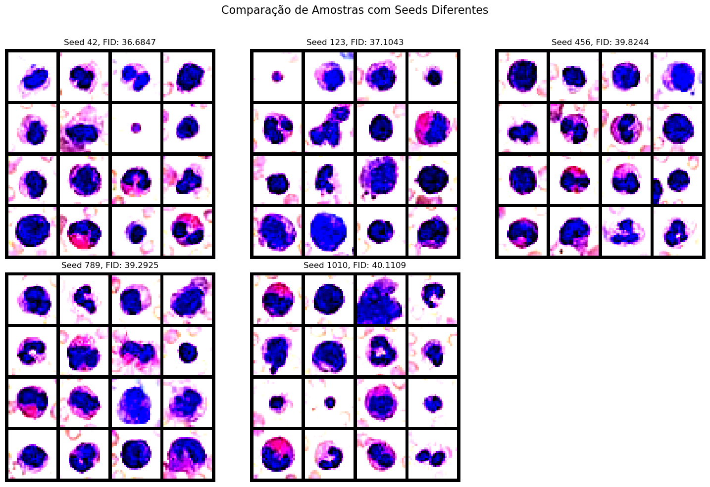
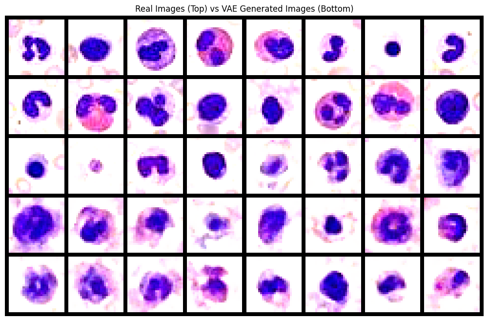
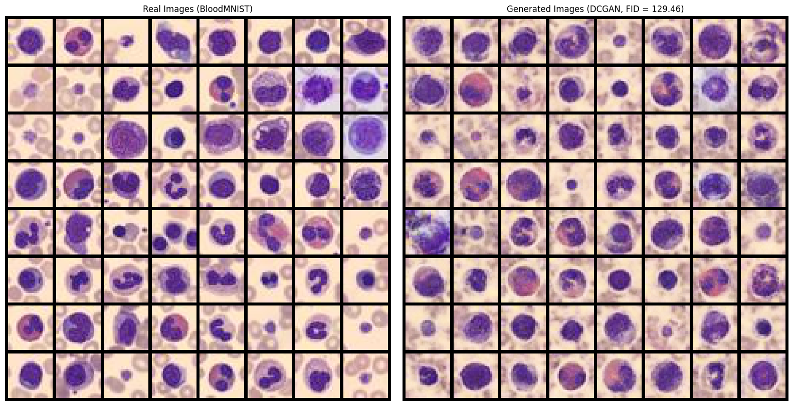
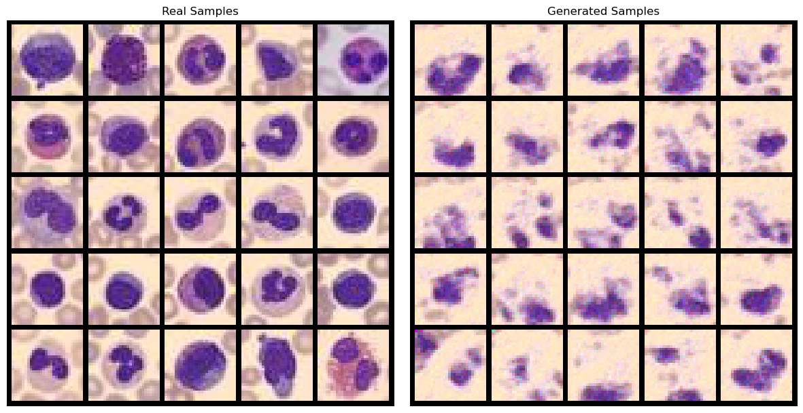

# Medical Image Generation Benchmark

A controlled comparison of four deep generative model families (DCGAN, VAE,
DDPM and PixelCNN) trained from scratch on blood cell microscopy images and
evaluated with Fréchet Inception Distance.

## Overview

Medical imaging datasets are small and class-imbalanced, which makes synthetic
image generation an attractive way to augment them. The obvious question is which
generative paradigm to reach for, and most published comparisons vary the model,
the dataset and the training budget all at once.

This project holds the dataset, the evaluation protocol and the tuning budget
fixed, and varies only the generative paradigm:

| Paradigm | Model |
|---|---|
| Adversarial | DCGAN |
| Variational inference | VAE |
| Diffusion | DDPM |
| Autoregressive | PixelCNN |

Each model was implemented in PyTorch, tuned by grid search, and then re-trained
five times with different random seeds so that the reported numbers include
run-to-run variance rather than a single lucky run.

## Approach

**Architectures.** DCGAN uses transposed-convolution generator and convolutional
discriminator with LeakyReLU and batch norm. VAE uses an MLP encoder/decoder over
a configurable latent space, trained on a β-weighted ELBO. DDPM uses a U-Net with
sinusoidal timestep embeddings and a linear β schedule over 1,000 timesteps.
PixelCNN uses masked convolutions with gated activations and residual blocks.

**Tuning.** Grid search per model, all trained with Adam and early stopping:

| Model | Grid |
|---|---|
| DCGAN | latent dim [100], feature maps [64, 128], lr [1e-4, 2e-4], β₁ [0.5, 0.0] |
| VAE | hidden dims [[512,256], [1024,512,256], [2048,1024,512]], latent [32, 128], β [0.1, 0.5, 1.0] |
| DDPM | model channels [64, 128], time embedding [256], lr [1e-4, 2e-4, 5e-4] |
| PixelCNN | hidden dims [64, 96], residual blocks [3, 5], lr [1e-3, 5e-4], weight decay [1e-5] |

**Evaluation.** FID between 10,000 real and 10,000 generated images, using
InceptionV3 features. Early stopping is driven by periodic FID evaluation rather
than by training loss, since generator loss is a poor proxy for sample quality.
The best configuration for each model is then re-run with five seeds.

## Dataset

[BloodMNIST](https://medmnist.com/) from the MedMNIST v2 collection: 17,092 RGB
images of 28×28 pixels covering eight blood cell types (basophil, eosinophil,
erythroblast, immature granulocyte, lymphocyte, monocyte, neutrophil, platelet).
All splits were combined to maximise training data, since the task is
unconditional generation rather than classification. The dataset is downloaded
automatically by the `medmnist` package.

## Results

Average FID across five runs with different random seeds (lower is better):

| Model | Average FID | Std | Best single run |
|---|---:|---:|---:|
| **DDPM** | **38.60** | ±1.43 | 38.60 |
| VAE | 148.08 | ±2.30 | 145.11 |
| PixelCNN | 234.24 | ±16.39 | 152.10 |
| DCGAN | 246.38 | ±103.14 | 129.46 |

DDPM wins by a wide margin and is also the most stable. The interesting result is
DCGAN: its *best* run (129.46) beats VAE, but its standard deviation of ±103
means that number is not something you can rely on getting. Several DCGAN runs
collapsed to near-uniform pink output. For an application where you need a
predictable result from a training run you do not get to supervise, the average
matters more than the best case.

PixelCNN's pixel-by-pixel generation captures local texture but not the global
cell structure, which is what the FID gap reflects.

| | |
|---|---|
|  |  |
| **DDPM**: consistent across all five seeds (FID 36.7–40.1) | **VAE**: correct structure and colour, characteristically blurry |
|  |  |
| **DCGAN**: sharp when it works (best run, FID 129.46) | **PixelCNN**: local texture without global cell structure |

Full write-up with methodology and discussion:
[`report/comparative_study_report.pdf`](report/comparative_study_report.pdf).

## Tech Stack

Python · PyTorch · torchvision · MedMNIST · NumPy · SciPy · scikit-learn ·
Matplotlib · Seaborn

## Repository Structure

```
notebooks/
  01_ddpm.ipynb       U-Net + diffusion process, FID-driven early stopping, seed study
  02_dcgan.ipynb      DCGAN generator/discriminator, grid search, seed study
  03_vae.ipynb        VAE + FlexibleVAE, β-weighted ELBO, dataset analysis, seed study
  04_pixelcnn.ipynb   masked convolutions, gated residual blocks, grid search
figures/              qualitative comparisons exported from the report
report/               the comparative study write-up (LNCS format)
```

Each notebook is self-contained: data loading, model, training loop, FID
implementation, tuning and multi-seed evaluation.

The notebooks keep every stored output, which makes two of them large enough
that GitHub declines to render them in the browser. They open normally once
downloaded, and nbviewer renders all four:

| Notebook | Size | View |
|---|---:|---|
| `01_ddpm.ipynb` | 2.1 MB | [nbviewer](https://nbviewer.org/github/JohnyPeters/medical-image-generation-benchmark/blob/main/notebooks/01_ddpm.ipynb) |
| `02_dcgan.ipynb` | 11 MB | [nbviewer](https://nbviewer.org/github/JohnyPeters/medical-image-generation-benchmark/blob/main/notebooks/02_dcgan.ipynb) |
| `03_vae.ipynb` | 9.2 MB | [nbviewer](https://nbviewer.org/github/JohnyPeters/medical-image-generation-benchmark/blob/main/notebooks/03_vae.ipynb) |
| `04_pixelcnn.ipynb` | 1.3 MB | [nbviewer](https://nbviewer.org/github/JohnyPeters/medical-image-generation-benchmark/blob/main/notebooks/04_pixelcnn.ipynb) |

## Running the Project

```bash
pip install -r requirements.txt
jupyter lab notebooks/
```

A CUDA GPU is required in practice. The full grid search plus five-seed re-runs
for all four models takes many GPU-hours, so the committed notebooks retain their
original outputs and figures. `medmnist` downloads BloodMNIST on first use, so
there is no manual data setup.

The original runs were executed locally on Windows with CUDA under Python 3.12.
Exact package versions were not recorded, so `requirements.txt` is unpinned;
re-running on current library versions may require minor API adjustments.

## Limitations

- BloodMNIST is 28×28. Conclusions about detail preservation are relative to that
  resolution and may not transfer to full-resolution histology.
- Generation is unconditional: there is no control over which of the eight cell
  types is produced.
- FID uses ImageNet-pretrained InceptionV3 features, which are not tuned for
  medical imagery. It is the standard metric, but it is a proxy, and no
  domain-specific metric or clinician assessment was used.
- The synthetic images were never evaluated on a downstream task (e.g. training a
  classifier on them), which is the test that would actually matter for data
  augmentation.
- Five seeds is enough to expose DCGAN's instability but is a small sample for
  the variance estimates themselves.

## Context

Developed with Alexandre Ferreira for the Advanced Machine Learning course of the
MSc in Artificial Intelligence and Data Science, University of Coimbra
(2024/2025). Parts of the implementation and documentation were written with
GitHub Copilot assistance, as disclosed at the top of each notebook.
